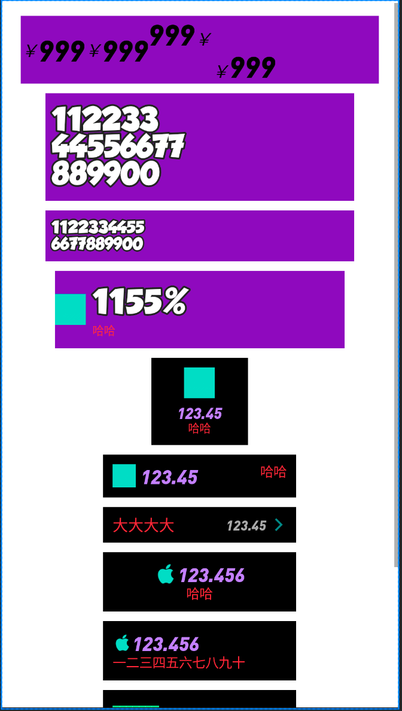
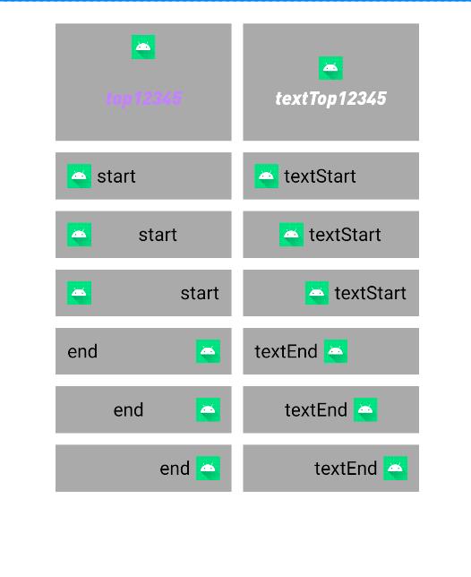
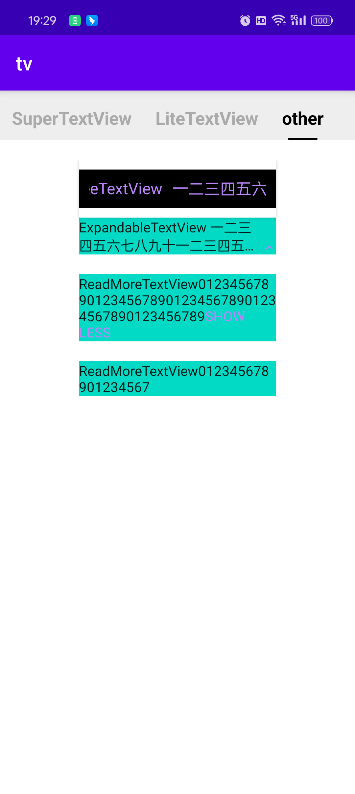

# tv

一些实用的自定义TextView

- SuperTextView - 两个文本一个图标，简化布局层级
  - 支持设置一个图标(icon/iconTint/iconSize/iconPadding/iconGravity)
  - 支持设置一个次要文本(subtext/subtextColor/subtextSize/subtextFont/subtextStyle/subtextGravity)
  - 支持文字描边
  - 支持文字渐变色(从上到下渐变)
  - 支持用尺寸设置字间距(和蓝湖等设计工具保持一致)
- LiteTextView - 单行文本+可选图标，继承自 View 比 TextView 更轻量
  - 支持文本属性(text/textColor/textSize/fontFamily/textStyle/gravity)
  - 支持设置图标(icon/iconTint/iconSize/iconPadding/iconGravity) 
- MarqueeTextView - 文本跑马灯效果(TextView 的跑马灯执行的条件过高)
  - 支持文本属性(text/textColor/textSize/fontFamily) 
- ExpandableTextView - 可展开收缩的的文本，点击切换状态，右下角显示状态图标(展开/收缩)
- ReadMoreTextView - 可展开收缩的的文本，点击切换状态，尾部显示状态文本(展开/收缩) 







 

## Gradle

``` groovy
repositories {
    maven { url "https://gitee.com/ezy/repo/raw/cosmo/"}
}
dependencies {
    implementation "me.reezy.cosmo:tv:0.10.0"
    implementation "me.reezy.cosmo:tv-marquee:0.10.0"
    implementation "me.reezy.cosmo:tv-expandable:0.10.0"
    implementation "me.reezy.cosmo:tv-readmore:0.10.0" 
}
```

## LICENSE

The Component is open-sourced software licensed under the [Apache license](LICENSE).