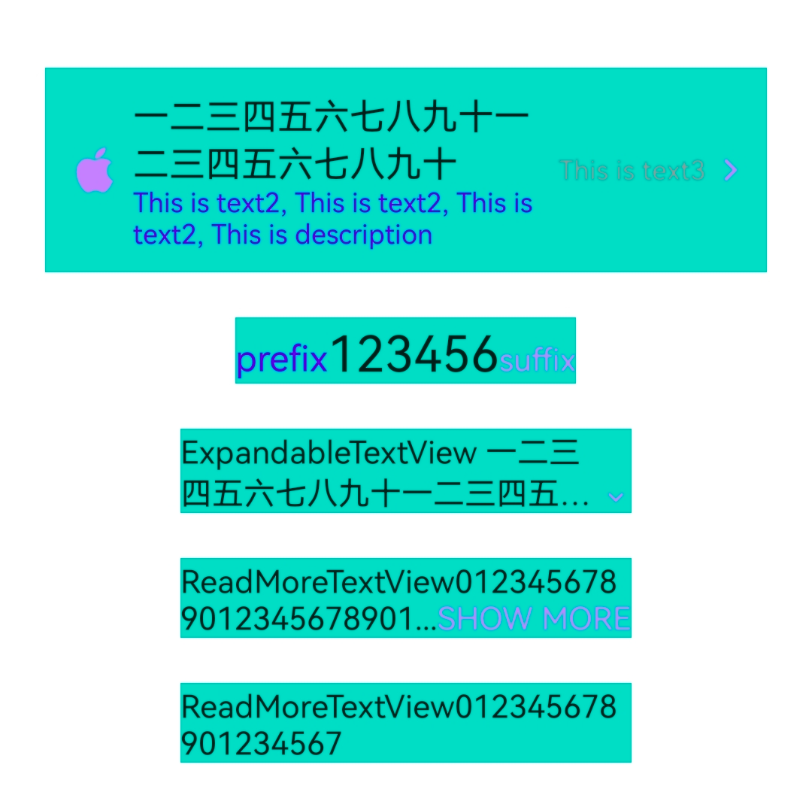

# tv

一些实用的自定义TextView

- CamelTextView - 可额外设置两个文本(prefix/suffix)，可用于带单位的数值，比如：<sub>￥</sub><b>123.0</b><sub>元</sub>
- ThreeTextView
  - 可额外设置两个文本(text2/text3)，text2 在 text 底下，text3 在右边
  - 可设置左右两个图标(leftIcon/rightIcon)
- ExpandableTextView - 可展开收缩的的文本，点击切换状态，右下角显示状态图标(展开/收缩)
- ReadMoreTextView - 可展开收缩的的文本，点击切换状态，尾部显示状态文本(展开/收缩)




## Gradle

``` groovy
repositories {
    maven { url "https://gitee.com/ezy/repo/raw/cosmo/"}
}
dependencies {
    implementation "me.reezy.cosmo:tv:0.7.0"
}
```

## LICENSE

The Component is open-sourced software licensed under the [Apache license](LICENSE).